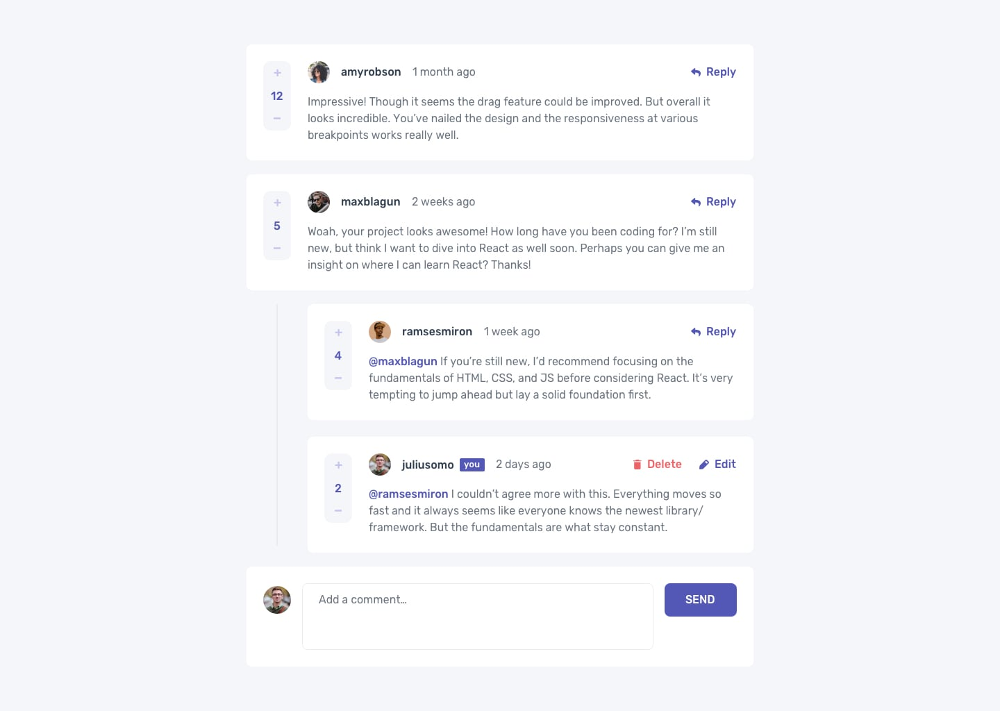

# Frontend Mentor - Interactive comments section solution

This is a solution to the [Interactive comments section challenge on Frontend Mentor](https://www.frontendmentor.io/challenges/interactive-comments-section-iG1RugEG9). Frontend Mentor challenges help you improve your coding skills by building realistic projects.

## Table of contents

- [Overview](#overview)
  - [The challenge](#the-challenge)
  - [Screenshot](#screenshot)
  - [Links](#links)
- [My process](#my-process)
  - [Built with](#built-with)
  - [Useful resources](#useful-resources)
- [Getting Started](#Getting Started)
- [Author](#author)

## Overview

Users should be able to:

- View the optimal layout for the app depending on their device's screen size
- See hover states for all interactive elements on the page
- Create, Read, Update, and Delete comments and replies
- Upvote and downvote comments
- **Bonus**: If you're building a purely front-end project, use `localStorage` to save the current state in the browser that persists when the browser is refreshed.
- **Bonus**: Instead of using the `createdAt` strings from the `data.json` file, try using timestamps and dynamically track the time since the comment or reply was posted.

### Screenshot

### Links

- Solution URL: 
- Live Site URL: 

## My process

### Built with

- [React](https://reactjs.org/) - JS library
- [TypeScript](https://www.typescriptlang.org/) - TypeScript
- [Redux]()
- [React-Redux]()
- [tailwind CSS](https://tailwindcss.com/)

### Useful resources

- [React With TypeScript Best Practices](https://www.sitepoint.com/react-with-typescript-best-practices/) - This is an amazing article which helped me finally understand using react and typeScript. I'd recommend it to anyone still learning this concept.
- [React with TypeScript cheatsheet](https://github.com/typescript-cheatsheets/react) - This helped me for using react and typescript. I really liked this pattern and will use it going forward.
- [Tailwind CSS Documentation](https://tailwindcss.com/) - This helped me a lot using tailwind css. A very good documentation

## Getting Started

    $ git clone https://github.com/Moro-Afriyie/Interactive-comments-section.git or you can download the zip file

    $ cd interactive-comments-section

    $ npm install

    $ npm run start

## Author

- Website - [Moro Owusu Afriyie]()
- Frontend Mentor - [@Moro-Afriyie](https://www.frontendmentor.io/profile/Moro-Afriyie)
- Twitter - [@NkatieBorga](https://twitter.com/NkatieBorga)
